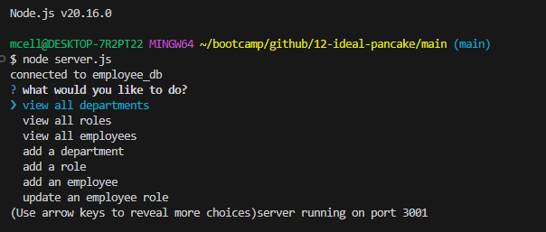
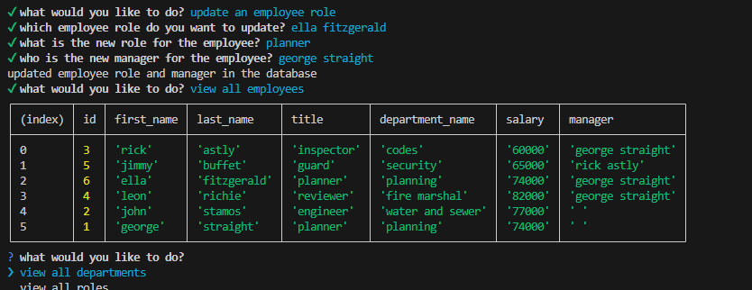

# Employee Database

  
## Description

This project is a database for a company with employee information on what their role is, what their salary is, and who their manager is. This database uses SQL queries to create tables, and then insert into and update rows within those tables.

This is my first project working with an SQL database, so I was able to learn a lot about how SQL queries work and how to use the proper syntax, which is very important with SQL because it is a very strict language when it comes to syntax.

A video walkthrough demonstrating the app in action can be found on [YouTube](https://youtu.be/Yjr97bihTsI).

## Contents

- [Installation](#installation)
- [Usage](#usage)
- [Credits](#contributing)
- [License](#license)

## Installation

In order to get the database to function, you will need to clone the repository to your local computer because there is currently no front end development for the application. Once you have the repository installed locally, you can run the `npm install` command in the `main/` directory to install the necessary dependencies to run the application.

You will then need to initialize the database by using the command `cd/db/` and `psql -U postgres` and enter the password for the postgres user. For this database, the password is `1612`. You will need to run the commands `\i schema.sql` to initalize the database and `\i seeds.sql` to seed the data.

You will then need to use the command `cd ..` to return to the `main/` directory and then run the command `node index.js` to initalize the inquirer prompts. You should be prompted with options on the screen as to what you want to edit within the database.

## Usage

There are 7 options you can choose to view or edit the database. you can view the employees, roles, or departments. You can also add a new employee, role, and department to the database. you can also edit an employee by updating their role and manager.

Exit ends the server.

## Contributing

This project was coded indenpendantly by github user mcellis1 with references made to the Vanderbilt University coding bootcamp lessons and mini project from module 12.

## License

For more information on license, refer to the [license document](./LICENSE).

## Questions

Questions about the project should be directed through the following contacts below.
Link to github profile: [mcellis1](https://github.com/mcellis1)
Email: [matthewcellis98@gmail.com](mailto:matthewcellis98@gmail.com)
